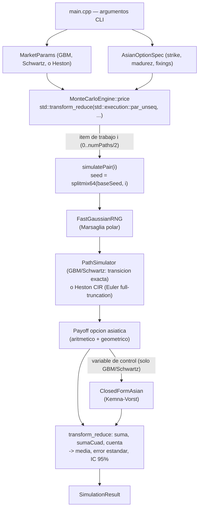

# Copper Options Monte Carlo

[](https://en.cppreference.com/w/cpp/20)
[](CMakeLists.txt)
[](include/MonteCarloEngine.h)
[](include/)
[](LICENSE)

**Español** | **[English](README.md)**

Un motor de simulación Monte Carlo de alto rendimiento, escrito en C++20
nativo, que valoriza opciones asiáticas (de promedio aritmético) sobre el
precio del cobre bajo tres modelos de dinámica de precio — GBM, Schwartz
(1997) de reversión a la media, y **Heston (1993) de volatilidad
estocástica** — paralelizado con `std::execution::par_unseq` (algoritmos
paralelos de C++20 de la biblioteca estándar), no una librería de hilos de
terceros. Cero dependencias externas — solo biblioteca estándar — con un
script de compilación MSVC sin configuración y un `CMakeLists.txt` portable.

## Valor de negocio

El cobre es uno de los casos más claros donde una opción asiática (de precio
promedio) importa en la práctica: productores, fundiciones y compradores
industriales cubren su exposición al precio *promedio* durante un período de
embarque o producción, no a una fecha de liquidación puntual, porque ese es
el riesgo que realmente asumen — los contratos de venta a concentradora,
los programas de cobertura trimestrales y los acuerdos de suministro físico
se valorizan y liquidan habitualmente sobre un promedio, no sobre un fixing
spot. Valorizar ese payoff no tiene fórmula cerrada cuando el promedio es
aritmético (solo el caso de promedio geométrico la tiene), lo que lo
convierte en un problema genuino de Monte Carlo para cualquier mesa que
necesite marcar o gestionar el riesgo de ese libro.

De ese caso de uso se derivan directamente dos objetivos de diseño:

- **El throughput importa operativamente, no solo académicamente.** Una mesa
  de riesgo que revalúa un libro de estructuras asiáticas bajo múltiples
  escenarios (shocks de spot, movimientos de la superficie de volatilidad,
  remarcados intradía) necesita que cada precio individual vuelva lo
  suficientemente rápido como para iterar. El motor multi-hilo convierte un
  pricer de varios segundos en un solo núcleo en uno de menos de un segundo
  — ver los números de escalamiento medidos más abajo.
- **La precisión tiene que ser demostrable, no asumida.** Un pricer rápido
  pero incorrecto es peor que uno lento, así que cada estimación se entrega
  junto con su error estándar e intervalo de confianza al 95%, y el motor se
  valida a sí mismo contra un precio analítico conocido en cada ejecución de
  `--self-test` en lugar de pedir confianza a ciegas.

## Impacto de Negocio e Indicadores Clave (KPIs)

| Métrica | Resultado | Qué significa |
|---|---|---|
| Speedup paralelo, 16 hilos vs. secuencial | **9,64x** (853.558 vs. 88.559 paths/seg) | Un precio de varios segundos en un núcleo pasa a menos de un segundo, reportado honestamente como sub-lineal (hyperthreading/ancho de banda de memoria), no como 16x |
| Reducción de varianza (variable de control) | error estándar 0,000007 vs. 0,000325 crudo | Intervalo de confianza ~46x más estrecho al mismo número de trayectorias, a costo extra casi nulo |
| Self-test vs. precio de forma cerrada (GBM) | diferencia 0,000712, dentro de tolerancia 4×error estándar | Verificación pass/fail de correctitud en cada ejecución, no un chequeo manual único |
| Self-test de paridad put-call de Heston | diferencia 0,000140, dentro de tolerancia 4×error estándar | Valida el modelo de volatilidad estocástica aunque no tenga precio asiático de forma cerrada |
| Throughput sostenido | ~1,2-1,4M paths/seg | Plano a través de distintos números de trayectorias -- la firma esperada de una carga genuinamente paralela sin dependencias |

## Arquitectura



Cada item de trabajo paralelo (un par antitético, o una trayectoria suelta)
deriva su propia semilla de RNG vía `splitmix64(baseSeed, workIndex)` y
simula hacia un buffer asignado en el stack — sin estado mutable
compartido, sin locks, y el resultado es independiente de cuántos hilos
trabajadores use realmente el runtime (a diferencia de la versión anterior
con `std::thread` manual, donde el conteo de hilos cambiaba qué
trayectorias caían en qué hilo).

### Decisiones de modelamiento

- **Tres modelos de dinámica de precio**: GBM, un modelo de reversión a la
  media de un factor (Schwartz, 1997) sobre `ln(S)` (la elección estándar
  para un commodity de recurso agotable como el cobre), y **Heston (1993)
  de volatilidad estocástica** (`--model heston`) — la varianza
  instantánea sigue su propia difusión CIR de reversión a la media,
  correlacionada con el proceso de precio vía `rho` (el "efecto
  apalancamiento" empíricamente negativo: una caída de precio suele
  coincidir con un salto de volatilidad).
- **Transición exacta donde existe, Euler donde no**: GBM y Schwartz usan
  su densidad de transición *exacta* en tiempo discreto, así que el error
  de simulación proviene únicamente del número de trayectorias, nunca del
  tamaño del paso. El proceso de varianza CIR no tiene un muestreador
  exacto simple, así que Heston usa el esquema estándar de Euler con
  full-truncation (Lord, Koekkoek & van Dijk, 2010) — documentado como un
  trade-off real de discretización en `MarketModel.h`, no escondido.
- **Reducción de varianza**: variables antitéticas (gratis — la trayectoria
  negada reutiliza los mismos sorteos aleatorios, sin costo adicional de
  RNG) más, para GBM/Schwartz, una variable de control de promedio
  geométrico anclada al precio cerrado de Kemna-Vorst (reduce el error
  estándar en aproximadamente dos órdenes de magnitud — ver números medidos
  abajo). Heston no tiene un ancla geométrico-asiática cerrada, así que cae
  a solo-antitéticas — documentado, no aplicado en silencio donde no sería
  válido.
- **RNG**: `std::mt19937_64` alimentando un generador normal Marsaglia-polar
  hecho a mano (sin `sin`/`cos`, solo `sqrt`/`log`, cachea el valor
  sobrante).

## Stack tecnológico

- **Lenguaje**: C++20, solo biblioteca estándar — `<random>`,
  `<execution>`, `<numeric>`, `<chrono>`. Sin numéricas de terceros, sin
  Boost.
- **Toolchain**: `CMakeLists.txt` (portable, `cmake --build`) o `cl.exe` de
  MSVC directo vía `build.ps1` — sin vcpkg, sin gestor de paquetes.
- **Concurrencia**: algoritmos paralelos de C++20
  (`std::transform_reduce(std::execution::par_unseq, ...)`), no un thread
  pool hecho a mano — el propio runtime de la biblioteca estándar programa
  el trabajo. `--threads 1` fuerza `std::execution::seq` para una línea
  base real de un solo hilo (usada por `--benchmark-scaling`).
- **Métodos cuantitativos**: GBM, reversión a la media de un factor
  (Schwartz, 1997), volatilidad estocástica de Heston (1993) (Euler
  full-truncation para el proceso de varianza CIR), valorización cerrada
  geométrico-asiática de Kemna-Vorst (1990), variables antitéticas y un
  estimador de variable de control.

## Compilación

**Con CMake** (cualquier compilador con soporte de algoritmos paralelos
C++20; en GCC/Clang, `std::execution::par_unseq` necesita TBB — ver
`CMakeLists.txt`):

```powershell
cmake -S . -B build -DCMAKE_BUILD_TYPE=Release
cmake --build build --config Release
ctest --test-dir build -C Release        # corre --self-test como test de CMake
```

**O directo con MSVC**, sin CMake:

```powershell
powershell -ExecutionPolicy Bypass -File .\build.ps1
```

`build.ps1` ubica `vcvars64.bat` automáticamente y compila `src/main.cpp`
con `/O2 /std:c++20 /EHsc /W4`, generando `bin\copper_mc.exe`.

## Uso

```powershell
.\bin\copper_mc.exe --self-test --benchmark-scaling
.\bin\copper_mc.exe --model heston --spot 4.5 --strike 4.6 --maturity 0.5 --type put
.\bin\copper_mc.exe --benchmark-paths
.\bin\copper_mc.exe --paths 1000000 --model heston --output-csv results.csv
.\bin\copper_mc.exe --help
```

Todos los parámetros de mercado/opción son valores de ejemplo ilustrativos
(documentados en `--help`), no un feed de cotizaciones en vivo.

`--output-csv FILE` agrega los parámetros y el resultado de la corrida
(precio, error estándar, IC 95%, throughput, timestamp) como una fila CSV,
escribiendo una línea de encabezado la primera vez que `FILE` no existe --
una forma sin dependencias de construir un registro local de escenarios a
través de corridas repetidas (p. ej. un barrido de spot/vol) sin recurrir a
una base de datos. `results.csv` está en `.gitignore` por ser salida local
de cada corrida, no parte del proyecto publicado.

## Resultados (medidos, no estimados)

Capturados de una ejecución real en la máquina de compilación (16 hilos
lógicos). Reproducibles con los comandos de arriba.

**Self-test — Monte Carlo vs. fórmula cerrada de Kemna-Vorst** (GBM,
promedio geométrico, 2.000.000 trayectorias):

| | Precio (USD) |
|---|---|
| Fórmula cerrada | 0.291034 |
| Monte Carlo | 0.291746 |
| \|diferencia\| | 0.000712 (tolerancia: 4 × error estándar = 0.001299) |
| **Resultado** | **PASS** |

**Self-test — paridad put-call de Heston** (promedio aritmético, identidad
independiente del modelo, 2.000.000 trayectorias por lado — ver
`runHestonParityTest` en `main.cpp` para por qué este chequeo es válido
aunque Heston no tenga fórmula cerrada para la opción asiática):

| | Valor (USD) |
|---|---|
| MC Call − Put | 0.054301 |
| Paridad Call − Put (independiente del modelo) | 0.054442 |
| \|diferencia\| | 0.000140 (tolerancia: 4 × error estándar combinado = 0.001622) |
| **Resultado** | **PASS** |

**Call asiático sobre cobre** — modelo Schwartz de reversión a la media,
spot = strike = 4.50 USD/lb, madurez de 1 año, 252 fixings diarios, σ =
0.28, r = 0.045, 4.000.000 trayectorias, con antitéticas + variable de
control activadas:

| Métrica | Valor |
|---|---|
| Precio | 0.299707 USD |
| Error estándar | 0.000007 |
| IC 95% | [0.299693, 0.299721] |
| Throughput | 1.306.658 trayectorias/seg |
| Tiempo transcurrido | 3.06 s |

**Escalamiento por hilos** (misma opción, 4.000.000 trayectorias,
`--benchmark-scaling`):

| Hilos | Throughput |
|---|---|
| 1 (`std::execution::seq`) | 88.559 trayectorias/seg |
| 16 (`std::execution::par_unseq`) | 853.558 trayectorias/seg |
| **Speedup medido** | **9.64x** |

**Tiempo transcurrido vs. número de trayectorias** (`--benchmark-paths`,
modelo Schwartz, antitéticas + variable de control activadas):

| Trayectorias | Elapsed (ms) | Throughput (trayectorias/seg) |
|---:|---:|---:|
| 100.000 | 69,5 | 1.439.319 |
| 500.000 | 365,5 | 1.367.857 |
| 1.000.000 | 767,6 | 1.302.723 |
| 2.000.000 | 1.522,5 | 1.313.665 |
| 4.000.000 | 3.282,5 | 1.218.589 |
| 8.000.000 | 6.103,7 | 1.310.674 |

El escalamiento sub-lineal en 16 hilos lógicos es esperable y se reporta con
honestidad: esta máquina tiene núcleos con hyperthreading, y el trabajo por
trayectoria es lo suficientemente liviano como para que el ancho de banda de
memoria y la sobrecarga del scheduler del sistema operativo empiecen a pesar
bastante antes de llegar a 16x. El throughput se mantiene aproximadamente
plano entre distintos números de trayectorias (~1,2-1,4M trayectorias/seg)
en vez de subir con N, la firma esperable de una carga de trabajo
embarazosamente paralela con items independientes: no hay efecto de
calentamiento ni de batching que explotar a N mayor, ya que el costo de
cada item de trabajo (simulación de trayectoria + semilla del RNG) es el
mismo sin importar cuántas otras trayectorias corran en paralelo.

## Estructura del proyecto

```
copper-options-montecarlo-cpp/
├── include/
│   ├── RandomEngine.h      # RNG gaussiano Marsaglia-polar
│   ├── MarketModel.h       # parametros GBM / Schwartz / Heston
│   ├── PathSimulator.h     # transicion exacta (GBM/Schwartz) + Heston CIR
│   ├── AsianOption.h       # especificacion de la opcion, promedio, payoff
│   ├── ClosedFormAsian.h   # formula cerrada de Kemna-Vorst
│   ├── MonteCarloEngine.h  # pricer con std::execution::par_unseq
│   └── Timer.h
├── src/
│   └── main.cpp            # CLI, self-tests, benchmarks
├── CMakeLists.txt
├── build.ps1
├── LICENSE
└── README.md / README.es.md
```

## Licencia

MIT — ver [LICENSE](LICENSE).

## Autor

**Pablo Reyes** — [github.com/Rxyxs](https://github.com/Rxyxs)
