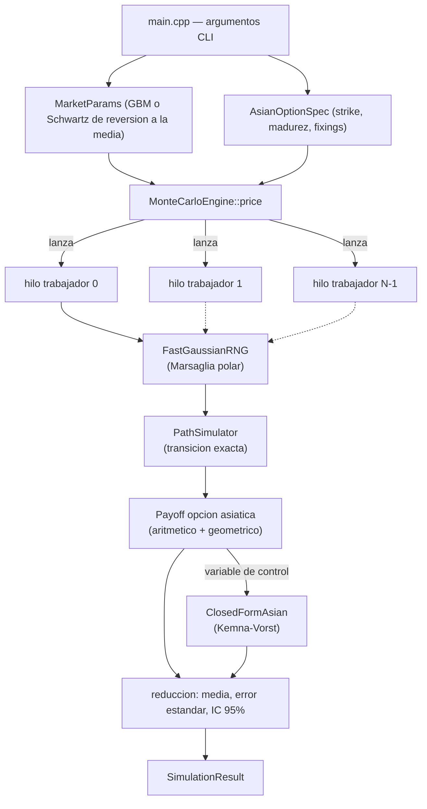

# Copper Options Monte Carlo

[](https://en.cppreference.com/w/cpp/17)
[](build.ps1)
[](include/)
[](LICENSE)

**Español** | **[English](README.md)**

Un motor de simulación Monte Carlo multi-hilo de alto rendimiento, escrito en
C++17 nativo, que valoriza opciones asiáticas (de promedio aritmético) sobre
el precio del cobre. Cero dependencias externas — solo la biblioteca
estándar (`<random>`, `<thread>`, `<chrono>`) — compilado directamente con
`cl.exe` de MSVC.

## Valor de negocio

El cobre es uno de los casos más claros donde una opción asiática (de precio
promedio) importa en la práctica: productores, fundiciones y compradores
industriales cubren su exposición al precio *promedio* durante un período de
embarque o producción, no a una fecha de liquidación puntual, porque ese es
el riesgo que realmente asumen — los contratos de venta a concentradora,
los programas de cobertura trimestrales y los acuerdos de suministro físico
se valorizan y liquidan habitualmente sobre un promedio, no sobre un fixing
spot. Valorizar ese payoff no tiene fórmula cerrada cuando el promedio es
aritmético (solo el caso de promedio geométrico la tiene), lo que lo
convierte en un problema genuino de Monte Carlo para cualquier mesa que
necesite marcar o gestionar el riesgo de ese libro.

De ese caso de uso se derivan directamente dos objetivos de diseño:

- **El throughput importa operativamente, no solo académicamente.** Una mesa
  de riesgo que revalúa un libro de estructuras asiáticas bajo múltiples
  escenarios (shocks de spot, movimientos de la superficie de volatilidad,
  remarcados intradía) necesita que cada precio individual vuelva lo
  suficientemente rápido como para iterar. El motor multi-hilo convierte un
  pricer de varios segundos en un solo núcleo en uno de menos de un segundo
  — ver los números de escalamiento medidos más abajo.
- **La precisión tiene que ser demostrable, no asumida.** Un pricer rápido
  pero incorrecto es peor que uno lento, así que cada estimación se entrega
  junto con su error estándar e intervalo de confianza al 95%, y el motor se
  valida a sí mismo contra un precio analítico conocido en cada ejecución de
  `--self-test` en lugar de pedir confianza a ciegas.

## Arquitectura



Cada hilo tiene su propio flujo de RNG y sus propios buffers de trayectoria
— sin estado mutable compartido ni locks en el bucle caliente. Cada hilo
escribe su suma acumulada en un slot dedicado del arreglo de resultados
exactamente una vez, al terminar su bloque de trabajo, por lo que tampoco
hay *false sharing*.

### Decisiones de modelamiento

- **Dinámica de precio**: por defecto, un modelo de reversión a la media de
  un factor (Schwartz, 1997) sobre `ln(S)` — la elección estándar para un
  commodity de recurso agotable como el cobre, que tiende a revertir hacia
  un nivel definido por el costo marginal de extracción en lugar de derivar
  libremente como una acción. GBM también está implementado (`--model
  gbm`), principalmente porque tiene una fórmula cerrada conocida para la
  opción asiática, lo que hace posible el self-test.
- **Transición exacta, no Euler**: ambos modelos usan su densidad de
  transición exacta en tiempo discreto, así que el error de simulación
  proviene únicamente del número de trayectorias, nunca del tamaño del paso
  de tiempo.
- **Reducción de varianza**: variables antitéticas (gratis — la trayectoria
  negada reutiliza los mismos sorteos aleatorios, sin costo adicional de
  RNG) más una variable de control de promedio geométrico anclada al precio
  cerrado de Kemna-Vorst. Como los promedios aritmético y geométrico de la
  misma trayectoria están altamente correlacionados, esto reduce el error
  estándar en aproximadamente dos órdenes de magnitud — ver números medidos
  abajo.
- **RNG**: `std::mt19937_64` alimentando un generador normal Marsaglia-polar
  hecho a mano (sin `sin`/`cos`, solo `sqrt`/`log`, cachea el valor
  sobrante).

## Stack tecnológico

- **Lenguaje**: C++17, solo biblioteca estándar — `<random>`, `<thread>`,
  `<chrono>`, `<cmath>`. Sin numéricas de terceros, sin Boost.
- **Toolchain**: `cl.exe` de MSVC (Visual Studio 2019/2022 Build Tools),
  invocado por `build.ps1`. Sin CMake, sin vcpkg, sin gestor de paquetes de
  ningún tipo.
- **Concurrencia**: `std::thread`, un flujo de RNG y un conjunto de buffers
  de trayectoria por hilo, agregación de resultados con una sola escritura
  por hilo — sin mutexes, sin atómicos, sin false sharing en la ruta
  caliente.
- **Métodos cuantitativos**: difusión de reversión a la media de un factor
  (Schwartz, 1997) y GBM, muestreo de transición exacta (no Euler),
  valorización cerrada geométrico-asiática de Kemna-Vorst (1990), variables
  antitéticas y un estimador de variable de control.

## Compilación

Requiere MSVC (Visual Studio 2019/2022 Build Tools o el IDE completo, con el
workload de C++). Sin CMake, sin vcpkg.

```powershell
powershell -ExecutionPolicy Bypass -File .\build.ps1
```

`build.ps1` ubica `vcvars64.bat` automáticamente y compila `src/main.cpp`
con `/O2 /std:c++17 /EHsc /W4`, generando `bin\copper_mc.exe`.

## Uso

```powershell
.\bin\copper_mc.exe --self-test --benchmark-scaling
.\bin\copper_mc.exe --spot 4.5 --strike 4.6 --maturity 0.5 --type put
.\bin\copper_mc.exe --help
```

Todos los parámetros de mercado/opción son valores de ejemplo ilustrativos
(documentados en `--help`), no un feed de cotizaciones en vivo.

## Resultados (medidos, no estimados)

Capturados de una ejecución real en la máquina de compilación (16 hilos
lógicos), con el timestamp de `git log` de este commit. Reproducibles con
los comandos de arriba.

**Self-test — Monte Carlo vs. fórmula cerrada de Kemna-Vorst** (GBM,
promedio geométrico, 2.000.000 trayectorias):

| | Precio (USD) |
|---|---|
| Fórmula cerrada | 0.291034 |
| Monte Carlo | 0.291638 |
| \|diferencia\| | 0.000604 (tolerancia: 4 × error estándar = 0.001300) |
| **Resultado** | **PASS** |

**Call asiático sobre cobre** — modelo Schwartz de reversión a la media,
spot = strike = 4.50 USD/lb, madurez de 1 año, 252 fixings diarios, σ =
0.28, r = 0.045, 4.000.000 trayectorias, con antitéticas + variable de
control activadas:

| Métrica | Valor |
|---|---|
| Precio | 0.299703 USD |
| Error estándar | 0.000007 |
| IC 95% | [0.299689, 0.299716] |
| Throughput | 1.257.091 trayectorias/seg |
| Tiempo transcurrido | 3.18 s |

**Escalamiento por hilos** (misma opción, 4.000.000 trayectorias):

| Hilos | Throughput |
|---|---|
| 1 | 153.686 trayectorias/seg |
| 16 | 1.257.091 trayectorias/seg |
| **Speedup medido** | **8.18x** |

El escalamiento sub-lineal en 16 hilos lógicos es esperable y se reporta con
honestidad: esta máquina tiene núcleos con hyperthreading, y el trabajo por
trayectoria es lo suficientemente liviano como para que el ancho de banda de
memoria y la sobrecarga del scheduler del sistema operativo empiecen a pesar
bastante antes de llegar a 16x.

## Estructura del proyecto

```
copper-options-montecarlo-cpp/
├── include/
│   ├── RandomEngine.h      # RNG gaussiano Marsaglia-polar
│   ├── MarketModel.h       # parametros GBM / Schwartz
│   ├── PathSimulator.h     # generacion de trayectorias con transicion exacta
│   ├── AsianOption.h       # especificacion de la opcion, promedio, payoff
│   ├── ClosedFormAsian.h   # formula cerrada de Kemna-Vorst
│   ├── MonteCarloEngine.h  # pricer multi-hilo
│   └── Timer.h
├── src/
│   └── main.cpp            # CLI
├── build.ps1
├── LICENSE
└── README.md / README.es.md
```

## Licencia

MIT — ver [LICENSE](LICENSE).

## Autor

**Pablo Reyes** — [github.com/Rxyxs](https://github.com/Rxyxs)
