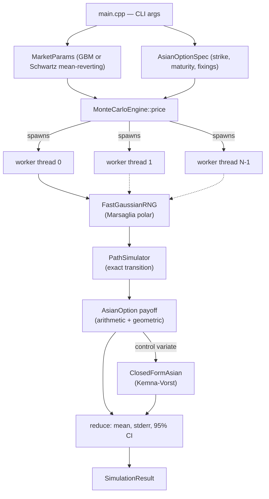

# Copper Options Monte Carlo

[](https://en.cppreference.com/w/cpp/17)
[](build.ps1)
[](include/)
[](LICENSE)

**[Español](README.es.md)** | **English**

A high-throughput, multi-threaded Monte Carlo engine, written in native
C++17, that prices arithmetic-average Asian options on copper. Zero external
dependencies — standard library only (`<random>`, `<thread>`, `<chrono>`) —
built directly with MSVC's `cl.exe`.

## Business value

Copper is one of the clearest cases where an Asian (average-price) option
matters in practice: producers, smelters, and industrial buyers hedge
exposure to the *average* price over a shipment or production period, not a
single settlement date, because that's the risk they actually carry —
concentrator offtake contracts, quarterly hedging programs, and physical
supply agreements are routinely priced and settled off an average, not a
spot fixing. Pricing that payoff has no closed form once the average is
arithmetic (only the geometric-average case does), which makes it a genuine
Monte Carlo problem for any desk that needs to mark or risk-manage this book.

Two design goals follow directly from that use case:

- **Throughput matters operationally, not just academically.** A risk desk
  revaluing a book of Asian structures under multiple scenarios (spot
  shocks, vol surface bumps, intraday re-marks) needs each individual price
  to come back fast enough to iterate. The multi-threaded engine here turns
  a multi-second single-core pricer into a sub-second one — see the measured
  scaling numbers below.
- **Precision has to be provable, not assumed.** A pricer that's fast but
  wrong is worse than a slow one, so every estimate ships with its standard
  error and 95% confidence interval, and the engine validates itself against
  a known analytic price on every `--self-test` run rather than asking for
  trust.

## Architecture



Each thread owns its RNG stream and its path buffers — no shared mutable
state and no locks in the hot loop. Every thread writes its accumulated sum
to one dedicated slot in a results array exactly once, after its chunk
finishes, so there's no false sharing either.

### Modeling choices

- **Price dynamics**: a single-factor Schwartz (1997) mean-reverting model
  on `ln(S)` by default — the standard choice for an exhaustible-resource
  commodity like copper, which tends to revert toward a level set by
  marginal extraction cost rather than drift freely the way an equity does.
  GBM is also implemented (`--model gbm`), mainly because it has a known
  closed-form Asian price, which is what makes the self-test possible.
- **Exact transition, not Euler**: both models use their exact discrete-time
  transition density, so simulation error comes only from the number of
  paths, never from the size of the time step.
- **Variance reduction**: antithetic variates (free — the negated path
  reuses the same random draws, no extra RNG cost) plus a geometric-average
  control variate anchored to the closed-form Kemna-Vorst price. Since
  arithmetic and geometric averages of the same path are highly correlated,
  this reduces the standard error by roughly two orders of magnitude — see
  measured numbers below.
- **RNG**: `std::mt19937_64` feeding a hand-rolled Marsaglia-polar normal
  generator (no `sin`/`cos`, just `sqrt`/`log`, caches the spare deviate).

## Tech stack

- **Language**: C++17, standard library only — `<random>`, `<thread>`,
  `<chrono>`, `<cmath>`. No third-party numerics, no Boost.
- **Toolchain**: MSVC `cl.exe` (Visual Studio 2019/2022 Build Tools), driven
  by `build.ps1`. No CMake, no vcpkg, no package manager of any kind.
- **Concurrency**: `std::thread`, one RNG stream and one set of path buffers
  per thread, single-write-per-thread result aggregation — no mutexes, no
  atomics, no false sharing in the hot path.
- **Quantitative methods**: single-factor Schwartz (1997) mean-reverting
  diffusion and GBM, exact (non-Euler) transition sampling, Kemna-Vorst
  (1990) closed-form geometric-Asian pricing, antithetic variates, and a
  control-variate estimator.

## Build

Requires MSVC (Visual Studio 2019/2022 Build Tools or full IDE, C++
workload). No CMake, no vcpkg.

```powershell
powershell -ExecutionPolicy Bypass -File .\build.ps1
```

`build.ps1` locates `vcvars64.bat` automatically and compiles
`src/main.cpp` with `/O2 /std:c++17 /EHsc /W4`, producing
`bin\copper_mc.exe`.

## Usage

```powershell
.\bin\copper_mc.exe --self-test --benchmark-scaling
.\bin\copper_mc.exe --spot 4.5 --strike 4.6 --maturity 0.5 --type put
.\bin\copper_mc.exe --help
```

All market/option parameters are illustrative example values (documented in
`--help`), not a live quote feed.

## Results (measured, not estimated)

Captured from an actual run on the build machine (16 logical threads),
`git log` timestamp of this commit. Reproduce with the commands above.

**Self-test — Monte Carlo vs. Kemna-Vorst closed form** (GBM, geometric
average, 2,000,000 paths):

| | Price (USD) |
|---|---|
| Closed form | 0.291034 |
| Monte Carlo | 0.291638 |
| \|difference\| | 0.000604 (tolerance: 4 × stderr = 0.001300) |
| **Result** | **PASS** |

**Copper Asian call** — Schwartz mean-reverting model, spot = strike = 4.50
USD/lb, 1-year maturity, 252 daily fixings, σ = 0.28, r = 0.045,
4,000,000 paths, antithetic + control variate on:

| Metric | Value |
|---|---|
| Price | 0.299703 USD |
| Std. error | 0.000007 |
| 95% CI | [0.299689, 0.299716] |
| Throughput | 1,257,091 paths/sec |
| Elapsed | 3.18 s |

**Thread scaling** (same option, 4,000,000 paths):

| Threads | Throughput | 
|---|---|
| 1 | 153,686 paths/sec |
| 16 | 1,257,091 paths/sec |
| **Measured speedup** | **8.18x** |

Sub-linear scaling on 16 logical threads is expected and honestly reported:
this machine has hyperthreaded cores, and per-path work is light enough that
memory bandwidth and OS scheduling overhead start to matter well before 16x.

## Project layout

```
copper-options-montecarlo-cpp/
├── include/
│   ├── RandomEngine.h      # Marsaglia-polar Gaussian RNG
│   ├── MarketModel.h       # GBM / Schwartz mean-reverting params
│   ├── PathSimulator.h     # exact-transition path generation
│   ├── AsianOption.h       # option spec, averaging, payoff
│   ├── ClosedFormAsian.h   # Kemna-Vorst closed form
│   ├── MonteCarloEngine.h  # multi-threaded pricer
│   └── Timer.h
├── src/
│   └── main.cpp            # CLI
├── build.ps1
├── LICENSE
└── README.md / README.es.md
```

## License

MIT — see [LICENSE](LICENSE).

## Author

**Pablo Reyes** — [github.com/Rxyxs](https://github.com/Rxyxs)
