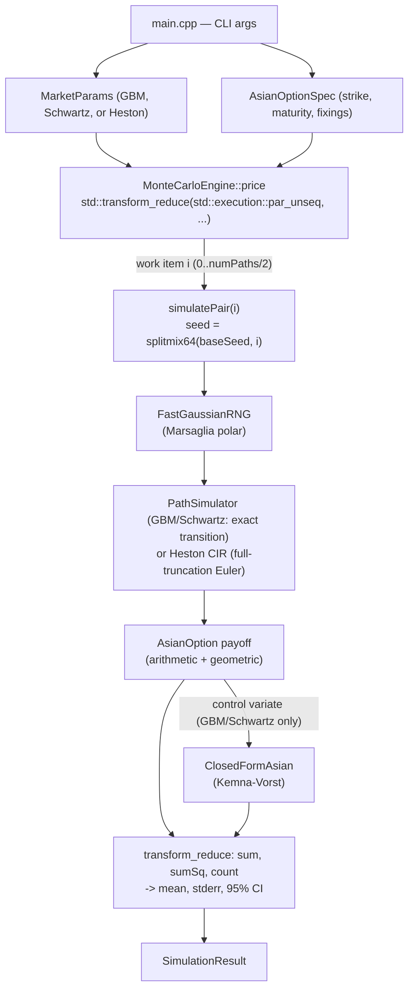

# Copper Options Monte Carlo

[](https://en.cppreference.com/w/cpp/20)
[](CMakeLists.txt)
[](include/MonteCarloEngine.h)
[](include/)
[](LICENSE)

**[Español](README.es.md)** | **English**

A high-throughput Monte Carlo engine, written in native C++20, that prices
arithmetic-average Asian options on copper under three price-dynamics
models — GBM, Schwartz (1997) mean-reverting, and **Heston (1993)
stochastic volatility** — parallelized with the standard library's
`std::execution::par_unseq` (C++20 parallel algorithms), not a third-party
threading library. Zero external dependencies — standard library only — with
both a zero-config MSVC build script and a portable `CMakeLists.txt`.

## Business value

Copper is one of the clearest cases where an Asian (average-price) option
matters in practice: producers, smelters, and industrial buyers hedge
exposure to the *average* price over a shipment or production period, not a
single settlement date, because that's the risk they actually carry —
concentrator offtake contracts, quarterly hedging programs, and physical
supply agreements are routinely priced and settled off an average, not a
spot fixing. Pricing that payoff has no closed form once the average is
arithmetic (only the geometric-average case does), which makes it a genuine
Monte Carlo problem for any desk that needs to mark or risk-manage this book.

Two design goals follow directly from that use case:

- **Throughput matters operationally, not just academically.** A risk desk
  revaluing a book of Asian structures under multiple scenarios (spot
  shocks, vol surface bumps, intraday re-marks) needs each individual price
  to come back fast enough to iterate. The multi-threaded engine here turns
  a multi-second single-core pricer into a sub-second one — see the measured
  scaling numbers below.
- **Precision has to be provable, not assumed.** A pricer that's fast but
  wrong is worse than a slow one, so every estimate ships with its standard
  error and 95% confidence interval, and the engine validates itself against
  a known analytic price on every `--self-test` run rather than asking for
  trust.

## Business Impact & Key Performance Indicators

| Metric | Result | What it means |
|---|---|---|
| Parallel speedup, 16 threads vs. sequential | **9.64x** (853,558 vs. 88,559 paths/sec) | A multi-second single-core price turns sub-second, honestly reported as sub-linear (hyperthreading/memory bandwidth), not asserted as 16x |
| Variance reduction (control variate) | stderr 0.000007 vs. 0.000325 raw | ~46x tighter confidence interval at the same path count, at effectively zero extra cost |
| Self-test vs. closed-form price (GBM) | diff 0.000712, within 4×stderr tolerance | Pass/fail correctness gate on every run, not a one-time manual check |
| Heston put-call parity self-test | diff 0.000140, within 4×stderr tolerance | Validates the stochastic-vol model even though it has no closed-form Asian price |
| Sustained throughput | ~1.2-1.4M paths/sec | Flat across path counts — the expected signature of a genuinely embarrassingly-parallel workload |

## Architecture



Each parallel work item (one antithetic pair, or one solo path) derives its
own RNG seed via `splitmix64(baseSeed, workIndex)` and simulates into a
stack-allocated buffer — no shared mutable state, no locks, and the result
is independent of how many worker threads the runtime actually uses (unlike
the earlier hand-rolled `std::thread`-chunked version, where thread count
changed which paths landed on which thread).

### Modeling choices

- **Three price-dynamics models**: GBM, a single-factor Schwartz (1997)
  mean-reverting model on `ln(S)` (the standard choice for an
  exhaustible-resource commodity like copper), and **Heston (1993)
  stochastic volatility** (`--model heston`) — instantaneous variance
  follows its own mean-reverting CIR diffusion, correlated with the price
  process via `rho` (the empirically negative "leverage effect": a price
  drop tends to coincide with a volatility spike).
- **Exact transition where one exists, Euler where it doesn't**: GBM and
  Schwartz use their *exact* discrete-time transition density, so
  simulation error comes only from path count, never time-step size. The
  CIR variance process has no simple exact sampler, so Heston uses the
  standard full-truncation Euler scheme (Lord, Koekkoek & van Dijk, 2010) —
  documented as a real discretization tradeoff in `MarketModel.h`, not
  glossed over.
- **Variance reduction**: antithetic variates (free — the negated path
  reuses the same random draws, no extra RNG cost) plus, for GBM/Schwartz,
  a geometric-average control variate anchored to the closed-form
  Kemna-Vorst price (reduces standard error by roughly two orders of
  magnitude — see measured numbers below). Heston has no closed-form
  geometric-Asian anchor, so it falls back to antithetic-only — documented,
  not silently applied where it wouldn't be valid.
- **RNG**: `std::mt19937_64` feeding a hand-rolled Marsaglia-polar normal
  generator (no `sin`/`cos`, just `sqrt`/`log`, caches the spare deviate).

## Tech stack

- **Language**: C++20, standard library only — `<random>`, `<execution>`,
  `<numeric>`, `<chrono>`. No third-party numerics, no Boost.
- **Toolchain**: `CMakeLists.txt` (portable, `cmake --build`) or MSVC
  `cl.exe` directly via `build.ps1` — no vcpkg, no package manager.
- **Concurrency**: C++20 parallel algorithms
  (`std::transform_reduce(std::execution::par_unseq, ...)`), not a
  hand-rolled thread pool — the standard library's own runtime schedules
  the work. `--threads 1` forces `std::execution::seq` for a true
  single-thread baseline (used by `--benchmark-scaling`).
- **Quantitative methods**: GBM, single-factor Schwartz (1997) mean
  reversion, Heston (1993) stochastic volatility (full-truncation Euler for
  the CIR variance process), Kemna-Vorst (1990) closed-form geometric-Asian
  pricing, antithetic variates, and a control-variate estimator.

## Build

**CMake** (any compiler with C++20 parallel-algorithm support; on
GCC/Clang, `std::execution::par_unseq` needs TBB — see `CMakeLists.txt`):

```powershell
cmake -S . -B build -DCMAKE_BUILD_TYPE=Release
cmake --build build --config Release
ctest --test-dir build -C Release        # runs --self-test as a CMake test
```

**Or MSVC directly**, no CMake:

```powershell
powershell -ExecutionPolicy Bypass -File .\build.ps1
```

`build.ps1` locates `vcvars64.bat` automatically and compiles
`src/main.cpp` with `/O2 /std:c++20 /EHsc /W4`, producing `bin\copper_mc.exe`.

## Usage

```powershell
.\bin\copper_mc.exe --self-test --benchmark-scaling
.\bin\copper_mc.exe --model heston --spot 4.5 --strike 4.6 --maturity 0.5 --type put
.\bin\copper_mc.exe --benchmark-paths
.\bin\copper_mc.exe --paths 1000000 --model heston --output-csv results.csv
.\bin\copper_mc.exe --help
```

All market/option parameters are illustrative example values (documented in
`--help`), not a live quote feed.

`--output-csv FILE` appends the run's parameters and result (price, std.
error, 95% CI, throughput, timestamp) as one CSV row, writing a header line
the first time `FILE` doesn't exist — a zero-dependency way to build up a
local scenario log across repeated runs (e.g. a spot/vol sweep) without
reaching for a database. `results.csv` is gitignored since it's run-local
output, not part of the published project.

## Results (measured, not estimated)

Captured from an actual run on the build machine (16 logical threads).
Reproduce with the commands above.

**Self-test — Monte Carlo vs. Kemna-Vorst closed form** (GBM, geometric
average, 2,000,000 paths):

| | Price (USD) |
|---|---|
| Closed form | 0.291034 |
| Monte Carlo | 0.291746 |
| \|difference\| | 0.000712 (tolerance: 4 × stderr = 0.001299) |
| **Result** | **PASS** |

**Self-test — Heston put-call parity** (arithmetic average, model-independent
identity, 2,000,000 paths each leg — see `runHestonParityTest` in `main.cpp`
for why this check is valid despite Heston having no closed-form Asian price):

| | Value (USD) |
|---|---|
| MC Call − Put | 0.054301 |
| Parity Call − Put (model-independent) | 0.054442 |
| \|difference\| | 0.000140 (tolerance: 4 × combined stderr = 0.001622) |
| **Result** | **PASS** |

**Copper Asian call** — Schwartz mean-reverting model, spot = strike = 4.50
USD/lb, 1-year maturity, 252 daily fixings, σ = 0.28, r = 0.045,
4,000,000 paths, antithetic + control variate on:

| Metric | Value |
|---|---|
| Price | 0.299707 USD |
| Std. error | 0.000007 |
| 95% CI | [0.299693, 0.299721] |
| Throughput | 1,306,658 paths/sec |
| Elapsed | 3.06 s |

**Thread scaling** (same option, 4,000,000 paths, `--benchmark-scaling`):

| Threads | Throughput |
|---|---|
| 1 (`std::execution::seq`) | 88,559 paths/sec |
| 16 (`std::execution::par_unseq`) | 853,558 paths/sec |
| **Measured speedup** | **9.64x** |

**Elapsed time vs. path count** (`--benchmark-paths`, Schwartz model,
antithetic + control variate on):

| Paths | Elapsed (ms) | Throughput (paths/sec) |
|---:|---:|---:|
| 100,000 | 69.5 | 1,439,319 |
| 500,000 | 365.5 | 1,367,857 |
| 1,000,000 | 767.6 | 1,302,723 |
| 2,000,000 | 1,522.5 | 1,313,665 |
| 4,000,000 | 3,282.5 | 1,218,589 |
| 8,000,000 | 6,103.7 | 1,310,674 |

Sub-linear scaling on 16 logical threads is expected and honestly reported:
this machine has hyperthreaded cores, and per-path work is light enough that
memory bandwidth and OS scheduling overhead start to matter well before 16x.
Throughput is roughly flat across path counts (~1.2-1.4M paths/sec) rather
than rising with N, which is the expected signature of an
embarrassingly-parallel, per-work-item-independent workload: there's no
warm-up or batching effect to exploit at larger N, since each work item's
cost (path simulation + RNG seeding) is the same regardless of how many
other paths run alongside it.

## Project layout

```
copper-options-montecarlo-cpp/
├── include/
│   ├── RandomEngine.h      # Marsaglia-polar Gaussian RNG
│   ├── MarketModel.h       # GBM / Schwartz / Heston params
│   ├── PathSimulator.h     # exact-transition (GBM/Schwartz) + Heston CIR paths
│   ├── AsianOption.h       # option spec, averaging, payoff
│   ├── ClosedFormAsian.h   # Kemna-Vorst closed form
│   ├── MonteCarloEngine.h  # std::execution::par_unseq pricer
│   └── Timer.h
├── src/
│   └── main.cpp            # CLI, self-tests, benchmarks
├── CMakeLists.txt
├── build.ps1
├── LICENSE
└── README.md / README.es.md
```

## License

MIT — see [LICENSE](LICENSE).

## Author

**Pablo Reyes** — [github.com/Rxyxs](https://github.com/Rxyxs)
