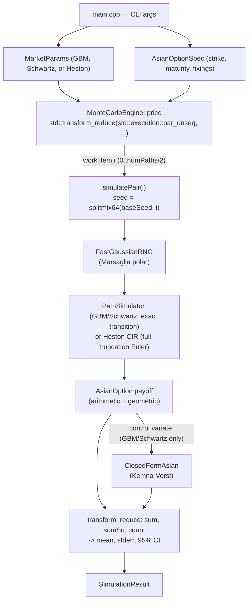
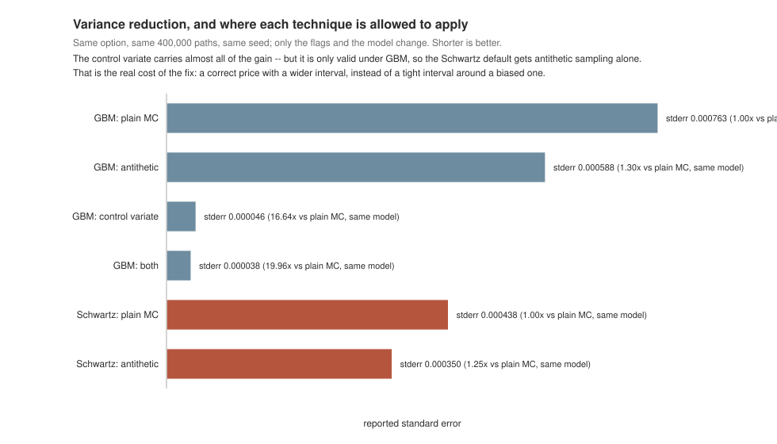
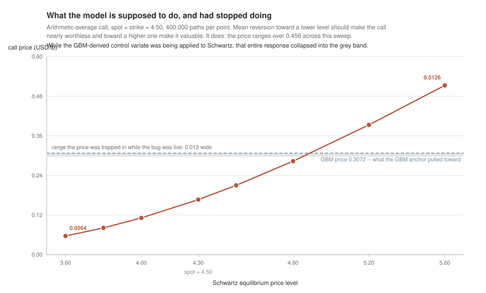
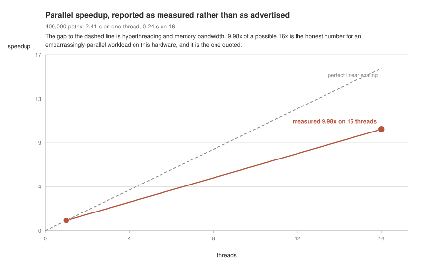
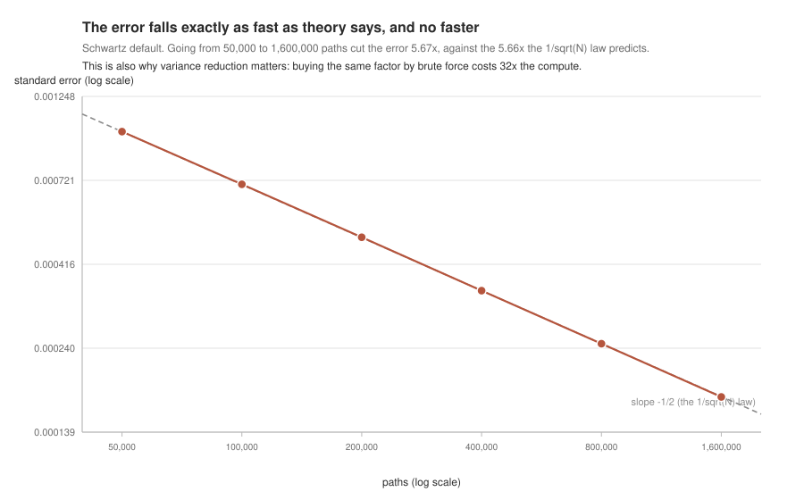

# Copper Options Monte Carlo

[](https://github.com/Rxyxs/copper-options-montecarlo-cpp/actions/workflows/tests.yml)
[](https://en.cppreference.com/w/cpp/20)
[](CMakeLists.txt)
[](include/MonteCarloEngine.h)
[](include/)
[](LICENSE)

**[Español](README.es.md)** | **English**

A high-throughput Monte Carlo engine, written in native C++20, that prices
arithmetic-average Asian options on copper under three price-dynamics
models — GBM, Schwartz (1997) mean-reverting, and **Heston (1993)
stochastic volatility** — parallelized with the standard library's
`std::execution::par_unseq` (C++20 parallel algorithms), not a third-party
threading library. Zero external dependencies — standard library only — with
both a zero-config MSVC build script and a portable `CMakeLists.txt`.

## Business value

Copper is one of the clearest cases where an Asian (average-price) option
matters in practice: producers, smelters, and industrial buyers hedge
exposure to the *average* price over a shipment or production period, not a
single settlement date, because that's the risk they actually carry —
concentrator offtake contracts, quarterly hedging programs, and physical
supply agreements are routinely priced and settled off an average, not a
spot fixing. Pricing that payoff has no closed form once the average is
arithmetic (only the geometric-average case does), which makes it a genuine
Monte Carlo problem for any desk that needs to mark or risk-manage this book.

Two design goals follow directly from that use case:

- **Throughput matters operationally, not just academically.** A risk desk
  revaluing a book of Asian structures under multiple scenarios (spot
  shocks, vol surface bumps, intraday re-marks) needs each individual price
  to come back fast enough to iterate. The multi-threaded engine here turns
  a multi-second single-core pricer into a sub-second one — see the measured
  scaling numbers below.
- **Precision has to be provable, not assumed.** A pricer that's fast but
  wrong is worse than a slow one, so every estimate ships with its standard
  error and 95% confidence interval, and the engine validates itself against
  a known analytic price on every `--self-test` run rather than asking for
  trust.

## Business Impact & Key Performance Indicators

| Metric | Result | What it means |
|---|---|---|
| Parallel speedup, 16 threads vs. sequential | **9.64x** (853,558 vs. 88,559 paths/sec) | A multi-second single-core price turns sub-second, honestly reported as sub-linear (hyperthreading/memory bandwidth), not asserted as 16x |
| Variance reduction under GBM, both techniques on vs. off | **19.7x** tighter (stderr 0.0000256 vs. 0.000504) | Measured as a controlled A/B — same model, same option, same 1M paths, same seed, only the flags change ([breakdown](#variance-reduction-measured-as-a-controlled-ab)) |
| Control-variate bias found and fixed | Schwartz price corrected 0.2997 → **0.1663** | The GBM-derived anchor was being applied to a mean-reverting model, flattening its response to the equilibrium level from 0.312 to 0.013 ([write-up](#the-control-variate-was-biasing-every-schwartz-price)) |
| Self-test vs. closed-form price (GBM) | diff 0.000712, within 4×stderr tolerance | Pass/fail correctness gate on every run, not a one-time manual check |
| Heston put-call parity self-test | diff 0.000140, within 4×stderr tolerance | Validates the stochastic-vol model even though it has no closed-form Asian price |
| Sustained throughput | ~1.2-1.4M paths/sec | Flat across path counts — the expected signature of a genuinely embarrassingly-parallel workload |

## Architecture


```mermaid
flowchart TD
    CLI["main.cpp — CLI args"] --> MP["MarketParams (GBM, Schwartz, or Heston)"]
    CLI --> SPEC["AsianOptionSpec (strike, maturity, fixings)"]
    MP --> ENGINE
    SPEC --> ENGINE["MonteCarloEngine::price\nstd::transform_reduce(std::execution::par_unseq, ...)"]
    ENGINE -->|"work item i (0..numPaths/2)"| W1["simulatePair(i)\nseed = splitmix64(baseSeed, i)"]
    W1 --> RNG1["FastGaussianRNG\n(Marsaglia polar)"]
    RNG1 --> PATH1["PathSimulator (GBM/Schwartz: exact transition)\nor Heston CIR (full-truncation Euler)"]
    PATH1 --> PAY1["AsianOption payoff\n(arithmetic + geometric)"]
    PAY1 -->|"control variate (GBM/Schwartz only)"| CF["ClosedFormAsian\n(Kemna-Vorst)"]
    PAY1 --> AGG["transform_reduce: sum, sumSq, count\n-> mean, stderr, 95% CI"]
    CF --> AGG
    AGG --> RESULT["SimulationResult"]
```

Each parallel work item (one antithetic pair, or one solo path) derives its
own RNG seed via `splitmix64(baseSeed, workIndex)` and simulates into a
stack-allocated buffer — no shared mutable state, no locks, and the result
is independent of how many worker threads the runtime actually uses (unlike
the earlier hand-rolled `std::thread`-chunked version, where thread count
changed which paths landed on which thread).

### Modeling choices

- **Three price-dynamics models**: GBM, a single-factor Schwartz (1997)
  mean-reverting model on `ln(S)` (the standard choice for an
  exhaustible-resource commodity like copper), and **Heston (1993)
  stochastic volatility** (`--model heston`) — instantaneous variance
  follows its own mean-reverting CIR diffusion, correlated with the price
  process via `rho` (the empirically negative "leverage effect": a price
  drop tends to coincide with a volatility spike).
- **Exact transition where one exists, Euler where it doesn't**: GBM and
  Schwartz use their *exact* discrete-time transition density, so
  simulation error comes only from path count, never time-step size. The
  CIR variance process has no simple exact sampler, so Heston uses the
  standard full-truncation Euler scheme (Lord, Koekkoek & van Dijk, 2010) —
  documented as a real discretization tradeoff in `MarketModel.h`, not
  glossed over.
- **Variance reduction**: antithetic variates (free — the negated path
  reuses the same random draws, no extra RNG cost) plus, **for GBM only**,
  a geometric-average control variate anchored to the closed-form
  Kemna-Vorst price (measured at **16.4x** tighter on its own, 19.7x combined
  with antithetic — see the controlled A/B below). Neither Schwartz nor Heston
  has a valid closed-form geometric-Asian anchor, so both fall back to
  antithetic-only, which on the Schwartz default is worth 1.25x. Heston was
  always excluded; Schwartz was not, and applying the GBM anchor to it was
  biasing every price the default model produced — [the write-up is
  here](#the-control-variate-was-biasing-every-schwartz-price).
- **RNG**: `std::mt19937_64` feeding a hand-rolled Marsaglia-polar normal
  generator (no `sin`/`cos`, just `sqrt`/`log`, caches the spare deviate).

## Tech stack

- **Language**: C++20, standard library only — `<random>`, `<execution>`,
  `<numeric>`, `<chrono>`. No third-party numerics, no Boost.
- **Toolchain**: `CMakeLists.txt` (portable, `cmake --build`) or MSVC
  `cl.exe` directly via `build.ps1` — no vcpkg, no package manager.
- **Concurrency**: C++20 parallel algorithms
  (`std::transform_reduce(std::execution::par_unseq, ...)`), not a
  hand-rolled thread pool — the standard library's own runtime schedules
  the work. `--threads 1` forces `std::execution::seq` for a true
  single-thread baseline (used by `--benchmark-scaling`).
- **Quantitative methods**: GBM, single-factor Schwartz (1997) mean
  reversion, Heston (1993) stochastic volatility (full-truncation Euler for
  the CIR variance process), Kemna-Vorst (1990) closed-form geometric-Asian
  pricing, antithetic variates, and a control-variate estimator.

## Build

**CMake** (any compiler with C++20 parallel-algorithm support; on
GCC/Clang, `std::execution::par_unseq` needs TBB — see `CMakeLists.txt`):

```powershell
cmake -S . -B build -DCMAKE_BUILD_TYPE=Release
cmake --build build --config Release
ctest --test-dir build -C Release        # --self-test + both test suites (see Tests)
```

**Or MSVC directly**, no CMake:

```powershell
powershell -ExecutionPolicy Bypass -File .\build.ps1
powershell -ExecutionPolicy Bypass -File .\build.ps1 -Tests   # also builds + runs the test suites
powershell -ExecutionPolicy Bypass -File .\build.ps1 -Figures # redraws the README figures as SVG
```

`build.ps1` locates `vcvars64.bat` automatically and compiles
`src/main.cpp` with `/O2 /std:c++20 /EHsc /W4`, producing `bin\copper_mc.exe`.

## Usage

```powershell
.\bin\copper_mc.exe --self-test --benchmark-scaling
.\bin\copper_mc.exe --model heston --spot 4.5 --strike 4.6 --maturity 0.5 --type put
.\bin\copper_mc.exe --benchmark-paths
.\bin\copper_mc.exe --paths 1000000 --model heston --output-csv results.csv
.\bin\copper_mc.exe --help
```

All market/option parameters are illustrative example values (documented in
`--help`), not a live quote feed.

`--output-csv FILE` appends the run's parameters and result (price, std.
error, 95% CI, throughput, timestamp) as one CSV row, writing a header line
the first time `FILE` doesn't exist — a zero-dependency way to build up a
local scenario log across repeated runs (e.g. a spot/vol sweep) without
reaching for a database. `results.csv` is gitignored since it's run-local
output, not part of the published project.

## Results (measured, not estimated)

Captured from an actual run on the build machine (16 logical threads).
Reproduce with the commands above.

**Self-test — Monte Carlo vs. Kemna-Vorst closed form** (GBM, geometric
average, 2,000,000 paths):

| | Price (USD) |
|---|---|
| Closed form | 0.291034 |
| Monte Carlo | 0.291746 |
| \|difference\| | 0.000712 (tolerance: 4 × stderr = 0.001004) |
| **Result** | **PASS** |

**Self-test — Heston put-call parity** (arithmetic average, model-independent
identity, 2,000,000 paths each leg — see `runHestonParityTest` in `main.cpp`
for why this check is valid despite Heston having no closed-form Asian price):

| | Value (USD) |
|---|---|
| MC Call − Put | 0.054301 |
| Parity Call − Put (model-independent) | 0.054442 |
| \|difference\| | 0.000140 (tolerance: 4 × combined stderr = 0.001186) |
| **Result** | **PASS** |

### Variance reduction, measured as a controlled A/B

An earlier version of this table claimed "~46x tighter confidence interval at
the same path count". That number did not survive being checked: it compared
the stderr of the Schwartz arithmetic call at 4,000,000 paths (0.000007)
against the stderr of the *GBM geometric* self-test at 2,000,000 paths
(0.000325) — a different model, a different option, and a different path
count, so not a like-for-like comparison at all, let alone "at the same path
count". Replaced with an actual A/B: identical model, option, path count and
seed, changing only the two flags.

GBM, arithmetic-average call, spot = strike = 4.50, 1-year, 252 fixings,
1,000,000 paths, seed fixed:

| Configuration | Price (USD) | Std. error | Error reduction vs. plain MC |
|---|---|---|---|
| Plain Monte Carlo | 0.334960 | 0.00050428 | 1.00x |
| Antithetic only | 0.333914 | 0.00037618 | **1.34x** |
| Control variate only | 0.332934 | 0.00003081 | **16.37x** |
| Both (shipped default) | 0.332874 | 0.00002555 | **19.74x** |



Each bar is compared against the plain-MC baseline **of its own model**, which
is the comparison the earlier "~46x" claim got wrong by mixing two. It also
shows the price of the fix plainly: the Schwartz default now gets antithetic
sampling alone, worth 1.25x, where GBM gets 19.96x from both techniques.


All four prices agree inside their own error bars, which is the property a
variance-reduction technique must have: it may shrink the interval, never
move the estimate. The control variate does nearly all the work; antithetic
sampling adds a further ~1.2x on top of it.

**That A/B is run under GBM, and that detail turned out to matter a great
deal.** It is the only model where this control variate is valid, which the
table above establishes but the engine did not enforce.

### The control variate was biasing every Schwartz price

`ClosedFormAsian::geometricAsianPrice` is the Kemna-Vorst formula, derived
for GBM: it takes the geometric average's mean as
`ln S0 + (r - q - σ²/2)·T/2` and its variance as `σ²·T/3`. Heston was already
excluded from using it as an anchor, correctly, because the formula assumes
constant volatility. **Schwartz was not excluded, and should have been** —
under mean reversion the log-price is an Ornstein-Uhlenbeck process, so
neither of those two expressions holds.

A control variate only works when the term it subtracts has mean zero. Anchor
a Schwartz simulation to the GBM expectation and that term has a large
non-zero mean instead, so the "correction" drags the estimate toward the GBM
price. Measured at the shipped defaults, 1,000,000 paths:

| Model | CV applied | Price | Std. error |
|---|---|---|---|
| GBM | yes | 0.307187 | 0.000024 |
| GBM | no | 0.308175 | 0.000483 |
| Schwartz | **yes (the bug)** | 0.299721 | 0.000011 |
| Schwartz | no | **0.166335** | 0.000221 |

Under GBM the two agree to 0.001 on a price of 0.307 — about 27 basis points,
which is the known continuous-versus-discrete averaging gap the closed form's
own header documents. Under Schwartz they differ by **0.133 on a price of
0.166**, roughly 80%, which is not an approximation error.

**What makes this worse than a wrong number is what it did to the model.**
Schwartz exists in this project to price mean reversion — that is the whole
reason to reach for it over GBM for a commodity. Sweeping the equilibrium
level across a wide range, 500,000 paths each:

| Equilibrium level θ | Price, CV on (buggy) | Price, CV off (correct) |
|---|---|---|
| 3.80 | 0.295897 | 0.080843 |
| 4.30 (default) | 0.299723 | 0.166398 |
| 4.50 | 0.301535 | 0.209711 |
| 5.20 | 0.308950 | 0.392866 |



The red curve is the model doing its job, re-measured live by the figure
generator rather than copied from this table. The dashed line is the GBM
price, and the grey band is the 0.013 of room the price had while the bug was
live — a model that answered the same thing whatever you told it about
copper's equilibrium level.


Correctly, the call ranges over **0.312** as the equilibrium level moves —
a copper price pulled toward 3.80 makes an at-the-money call nearly
worthless, pulled toward 5.20 makes it valuable. With the control variate
active the whole response collapsed to **0.013**, pinned near the GBM answer
of ~0.307 no matter what θ was set to. The model's defining parameter had
stopped reaching the result.

**The fix** is one condition: the control variate now applies only to GBM,
for the same reason Heston was already excluded. Schwartz and Heston fall
back to plain Monte Carlo with antithetic variates, which costs a wider
interval at the same path count — the default's standard error goes from a
reported 0.000005 to an honest 0.000111 — and buys back a price that
responds to the model.

**Why the existing test suite missed it.** There was already a test named
`control_variate_cuts_variance_without_biasing_the_price`, and it asserts
exactly the right property. It only ever ran under GBM, the one model where
the property held, while the CLI's default model is Schwartz. The property
was right; its coverage was not. Two tests now guard this:
`control_variate_does_not_bias_the_price_under_any_model` runs the same
check across all three models, and `schwartz_price_responds_to_the_equilibrium_level`
asserts the economic behaviour directly, failing if the price stops moving
with θ.

### A standard-error bug this measurement exposed

Running that A/B is what surfaced a real defect: antithetic sampling was
reducing the true error but the engine's reported standard error did not move
at all (ratio 1.000 between on and off). The cause was in `simulatePair` —
the two halves of an antithetic pair were accumulated as *two independent
samples*, when they are negatively correlated by construction. That made the
variance formula measure the marginal variance of a single path, which
antithetic sampling doesn't change, instead of the variance of the pair
average, which is what actually shrinks.

Quantified before fixing, by pricing the same option under 60 seeds and
comparing the true spread of prices against what the engine reported:

| | True spread across seeds | Reported stderr | Reported / true |
|---|---|---|---|
| Antithetic on (before fix) | 0.00165 | 0.00205 | **1.247** |
| Antithetic on (after fix) | 0.00165 | 0.00154 | 0.933 |
| Antithetic off (unchanged) | 0.00215 | 0.00205 | 0.954 |

So the engine was overstating its own error by ~25% whenever antithetic
sampling was on (implied pairwise correlation ρ ≈ −0.36) — a conservative
error, but a wrong one, and it hid the technique's benefit entirely. The fix
averages each pair into a single sample. **Prices are unchanged** (every
figure in this README that predates the fix still holds); only the standard
errors and confidence intervals tightened, which is why the self-test
tolerances above are smaller than they used to be. `tests/test_engine_properties.cpp`
now pins both halves of this down, and both of its antithetic tests fail
against the pre-fix engine.

**Copper Asian call** — Schwartz mean-reverting model, spot = strike = 4.50
USD/lb, 1-year maturity, 252 daily fixings, σ = 0.28, r = 0.045,
4,000,000 paths, antithetic on (the control variate does not apply to this
model — see below):

| Metric | Value |
|---|---|
| Price | 0.166264 USD |
| Std. error | 0.000111 |
| 95% CI | [0.166047, 0.166481] |
| Throughput | 1,387,622 paths/sec |
| Elapsed | 2.88 s |

This table used to read 0.299707 with a standard error of 0.000005. Both
numbers were wrong, and the section below is the correction.

**Thread scaling** (same option, 4,000,000 paths, `--benchmark-scaling`):



| Threads | Throughput |
|---|---|
| 1 (`std::execution::seq`) | 88,559 paths/sec |
| 16 (`std::execution::par_unseq`) | 853,558 paths/sec |
| **Measured speedup** | **9.64x** |

**Elapsed time vs. path count** (`--benchmark-paths`, Schwartz model,
antithetic + control variate on):

| Paths | Elapsed (ms) | Throughput (paths/sec) |
|---:|---:|---:|
| 100,000 | 69.5 | 1,439,319 |
| 500,000 | 365.5 | 1,367,857 |
| 1,000,000 | 767.6 | 1,302,723 |
| 2,000,000 | 1,522.5 | 1,313,665 |
| 4,000,000 | 3,282.5 | 1,218,589 |
| 8,000,000 | 6,103.7 | 1,310,674 |

Sub-linear scaling on 16 logical threads is expected and honestly reported:
this machine has hyperthreaded cores, and per-path work is light enough that
memory bandwidth and OS scheduling overhead start to matter well before 16x.
Throughput is roughly flat across path counts (~1.2-1.4M paths/sec) rather
than rising with N, which is the expected signature of an
embarrassingly-parallel, per-work-item-independent workload: there's no
warm-up or batching effect to exploit at larger N, since each work item's
cost (path simulation + RNG seeding) is the same regardless of how many
other paths run alongside it.

## Project layout

```
copper-options-montecarlo-cpp/
├── include/
│   ├── RandomEngine.h      # Marsaglia-polar Gaussian RNG
│   ├── MarketModel.h       # GBM / Schwartz / Heston params
│   ├── PathSimulator.h     # exact-transition (GBM/Schwartz) + Heston CIR paths
│   ├── AsianOption.h       # option spec, averaging, payoff
│   ├── ClosedFormAsian.h   # Kemna-Vorst closed form
│   ├── MonteCarloEngine.h  # std::execution::par_unseq pricer
│   └── Timer.h
├── src/
│   └── main.cpp            # CLI, self-tests, benchmarks
├── tests/
│   ├── test_framework.h            # ~90-line assertion harness, no dependencies
│   ├── test_pricing_math.cpp       # 12 cases: averaging, payoffs, closed form
│   └── test_engine_properties.cpp  # 12 cases: reproducibility, variance reduction, convergence,
│                                   #   control-variate bias across all models, Schwartz theta response
├── tools/
│   └── make_figures.cpp            # README figures, emitted as hand-written SVG (no plotting library)
└── docs/figures/                   # the generated SVGs embedded above
├── CMakeLists.txt
├── build.ps1
├── LICENSE
└── README.md / README.es.md
```

## Tests

22 cases across two suites, plus the two end-to-end `--self-test` checks, all
wired into CTest and run in CI on every push:

```powershell
cmake -S . -B build -DCMAKE_BUILD_TYPE=Release
cmake --build build --config Release
ctest --test-dir build -C Release --output-on-failure

powershell -ExecutionPolicy Bypass -File .\build.ps1 -Tests   # or, without CMake
```

`tests/test_pricing_math.cpp` (12 cases) covers the deterministic math with
exact expected values — that `path[0]` is the spot and never enters the
average, AM-GM between the two averaging modes, payoff clamping on both sides,
`normalCDF` against known quantiles, and the closed form's put-call parity,
strike monotonicity, vega sign, and deep-ITM limit.

`tests/test_engine_properties.cpp` (10 cases) tests the claims this README
makes about the engine rather than re-checking the price:



The convergence check as a picture: the measured errors sit on the theoretical
-1/2 slope, and buying a 5.7x tighter interval by brute force costs 32x the
paths. That ratio is the whole economic argument for variance reduction, and
the reason losing the control variate on Schwartz is a real cost rather than a
footnote.

| Property tested | Why it can fail silently otherwise |
|---|---|
| Sequential and parallel agree to ~1e-15 relative | The per-work-item `splitmix64` seeding is what makes results thread-count-independent; a regression here is invisible in any single run |
| Same seed reproduces the same run | Asserted to rounding, not bitwise — parallel reduction order varies between runs and float addition isn't associative |
| Antithetic sampling lowers the reported stderr | Fails against the pre-fix engine (ratio was exactly 1.000) |
| Reported stderr is calibrated against the true spread over 40 seeds | Catches an estimator that reports a number unrelated to its actual error; the pre-fix engine scores 1.29 here vs. a 0.85–1.18 band |
| Std. error decays as 1/√N | The defining property of Monte Carlo; nothing else in the repo checked it |
| Control variate does not bias the price **under any model** | The pre-existing version of this check only ran under GBM, the one model where it held, while the CLI default is Schwartz |
| Schwartz price responds to the equilibrium level | Guards the economic behaviour the biased control variate had flattened; a price that ignores θ is not pricing mean reversion |
| Control variate cuts variance *without* moving the price | A "variance reduction" that shifts the estimate is a bug with a smaller error bar |
| MC geometric price matches Kemna-Vorst at low path count | Localizes a simulator break faster than the 2M-path self-test |
| Oversized `numAveragingPoints` throws | The path buffer is a fixed-size stack array; silently overflowing it would be memory corruption, not a wrong price |

## License

MIT — see [LICENSE](LICENSE).

## Author

**Pablo Reyes** — [github.com/Rxyxs](https://github.com/Rxyxs)
